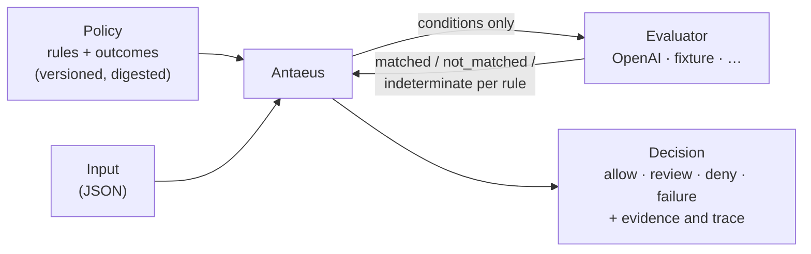

<p align="center">
  <a href="https://antaeus.io">
    <picture>
      <source media="(prefers-color-scheme: dark)" srcset="./docs/assets/antaeus-lockup-on-dark.svg">
      <source media="(prefers-color-scheme: light)" srcset="./docs/assets/antaeus-lockup-on-light.svg">
      
    </picture>
  </a>
</p>

<p align="center">
  <b>Turn human-written policies into versioned, testable decisions your application can trust.</b>
</p>

<p align="center">
  <a href="https://github.com/antaeusio/antaeus/releases/latest"></a>
  <a href="https://github.com/antaeusio/antaeus/actions/workflows/validate.yml"></a>
  <a href="https://pkg.go.dev/github.com/antaeusio/antaeus"></a>
  <a href="./LICENSE"></a>
</p>

<p align="center">
  <a href="https://antaeus.io">Website</a> ·
  <a href="./docs/quickstart.md">Quickstart</a> ·
  <a href="./docs/policy-authoring.md">Writing policies</a> ·
  <a href="./docs/decisions.md">Reading decisions</a> ·
  <a href="https://github.com/antaeusio/antaeus/releases">Releases</a>
</p>

---

Some rules can't be written as `if` statements: *"no counterfeit goods"*,
*"no medical claims"*, *"flag anything that looks like harassment"*. Teams
usually bury these in a prompt and hope for consistent answers.

**Antaeus** makes that judgment an explicit, inspectable decision. You write
the policy as named rules with plain-language conditions and a fixed outcome
for each. An evaluator (a language model, or a deterministic fixture for tests)
only reports **whether each condition applies**. Antaeus then applies *your*
outcomes deterministically and returns a typed Decision (`allow`, `review`,
`deny`, or `failure`) that records the policy digest, the evaluator, the model,
and every attempt.

> [!NOTE]
> Antaeus is early and pre-v1. [v0.1.0](https://github.com/antaeusio/antaeus/releases/tag/v0.1.0)
> is the first release. The OpenAI evaluator is **experimental**: it has not
> yet been measured for accuracy and is not suitable for enforcement on its own.

## Highlights

- **Policy as a versioned artifact.** Plain YAML or JSON with a canonical
  SHA-256 digest, so every Decision names the exact policy version it used.
- **Outcomes stay yours.** Evaluators never see `allow` / `review` / `deny`;
  they only judge conditions. A matched `deny` always wins.
- **Failure is a real outcome.** Timeouts, refusals, malformed model output,
  and unresolved rules become an explicit `failure`, never a silent `allow`.
- **Provider-neutral.** Evaluators plug in behind one interface: a
  credential-free deterministic fixture today, OpenAI with your own key, and
  more to come. Retries, deadlines, fallbacks, and traces live in a separate
  evaluator profile.
- **Testable.** Named regression cases run offline and credential-free, so
  policy changes can be reviewed like code.
- **Local-first.** A single Go binary with no account, service, or database.

## Install

```sh
brew install antaeusio/tap/antaeus                            # macOS or Linux
go install github.com/antaeusio/antaeus/cmd/antaeus@latest    # Go 1.26 or newer
```

Prebuilt archives for macOS, Linux, and Windows are attached to every
[release](https://github.com/antaeusio/antaeus/releases), with `SHA256SUMS`
and build-provenance attestations
(`gh attestation verify <archive> --repo antaeusio/antaeus`).

## Example: moderate marketplace listings

**1. Write the policy** as `listing-policy.yaml`:

```yaml
apiVersion: policy.antaeus.io/v0alpha1
kind: Policy
metadata:
  name: marketplace-listing
  description: Decide whether a marketplace listing can be published.
spec:
  defaultOutcome: review
  rules:
    - id: prohibited-item
      description: Deny listings for items the marketplace does not allow.
      when: The listing offers weapons, counterfeit goods, or prescription drugs.
      outcome: deny
    - id: complete-listing
      description: Publish complete, ordinary listings automatically.
      when: The listing clearly describes a legal item with its condition and price.
      outcome: allow
```

```console
$ antaeus validate listing-policy.yaml
{"name":"marketplace-listing","digest":"sha256:d1553c7d6e4eead5b362c0b5e3447f4db2e00c0f861f5fe876e775ccf188b0d4","rules":2}
```

**2. Describe the input** to decide, for example `replica-watch.json`:

```json
{"title": "Luxury watch, 1:1 replica", "description": "Looks identical to the original brand, comes with fake certificate. Ships worldwide.", "price": "95 USD"}
```

**3. Evaluate it** with the OpenAI evaluator profile and your own API key:

```console
$ curl -fsSL -o openai.json https://raw.githubusercontent.com/antaeusio/antaeus/v0.1.0/examples/openai/profile.json
$ export OPENAI_API_KEY=sk-...
$ antaeus evaluate-profile --policy listing-policy.yaml --input replica-watch.json --profile openai.json
```

```jsonc
{
  "kind": "Decision",
  "outcome": "deny",
  "policy": { "name": "marketplace-listing", "digest": "sha256:d1553c7d…" },
  "ruleResults": [
    { "ruleId": "prohibited-item", "status": "matched", "outcome": "deny" },
    { "ruleId": "complete-listing", "status": "not_matched" }
  ],
  "reasonCodes": ["policy.deny_rule_matched"],
  "evaluator": {
    "adapter": "io.antaeus.openai",
    "mode": "semantic",
    "model": "gpt-5.4-mini-2026-03-17",
    "attempts": 1
  }
  // … plus the profile digest and a per-attempt execution trace
}
```

A complete, ordinary listing, such as `{"title": "Canon AE-1 film camera", …}`,
matches `complete-listing` and returns `"outcome": "allow"`. Anything the model
can't decide becomes `failure`, so your application can route it to a person.
Both inputs are in [`examples/marketplace`](./examples/marketplace).

> [!TIP]
> No API key? The [five-minute quickstart](./docs/quickstart.md) runs the same
> contract with a credential-free deterministic fixture and a regression suite.

## How it works



1. Antaeus loads and validates the policy, then computes its digest.
2. The evaluator profile chooses the evaluator, deadline, retries, and fallbacks.
3. The evaluator receives only the rule conditions and the input, and answers
   each condition.
4. Antaeus attaches your outcomes to the matched rules and reduces them
   deterministically, with `deny` taking precedence and `failure` for unresolved
   evidence.

Antaeus does not replace authentication, authorization, or deterministic
business rules. If a rule can be written safely as ordinary code, keep it in
code.

## Documentation

| Guide | What it covers |
| --- | --- |
| [Quickstart](./docs/quickstart.md) | Validate, evaluate, and test locally without credentials |
| [Writing policies](./docs/policy-authoring.md) | Policy fields, syntax, and digest identity |
| [Reading a Decision](./docs/decisions.md) | Outcomes, failures, and fallback boundaries |
| [OpenAI evaluator](./docs/openai-adapter.md) | Setup, request boundary, failures, and data handling |
| [Profile execution](./docs/profile-execution.md) | Retries, deadlines, routing, and traces |
| [CLI configuration](./docs/cli-configuration.md) | Profile selection, credential bindings, and project trust |
| [Evaluator adapters](./docs/evaluator-adapters.md) | Embedding in Go and writing an adapter |
| [Portable contracts](./contracts/README.md) | JSON Schemas, OpenAPI, and conformance fixtures |
| [Compatibility](./docs/compatibility.md) | Pre-v1 policy and supported platforms |

## Development

Antaeus is a Go module (`github.com/antaeusio/antaeus`) that requires Go 1.26 or
newer; Go 1.27.1 is preferred. Build and test through the repository scripts,
which serialize builds with a shared lock:

```sh
scripts/check              # formatting, shell analysis, vet, and tests
scripts/build              # builds .tmp/bin/antaeus
scripts/cross-build        # all release targets
```

Releases come from the tag-triggered workflow described in
[releasing](./docs/releasing.md). See the [changelog](./CHANGELOG.md) for what
each version contains.

## Contributing and security

Contributions are welcome. Start with [CONTRIBUTING.md](./CONTRIBUTING.md) and
[GOVERNANCE.md](./GOVERNANCE.md). Report vulnerabilities privately as described
in [SECURITY.md](./SECURITY.md). Participation is governed by the
[Code of Conduct](./CODE_OF_CONDUCT.md).

## License

Antaeus is licensed under the [Apache License 2.0](./LICENSE).
